# Sprints 1 al 4 – Configuración de Infraestructura

## URLs de referencia

* Sprint 1: [https://chatgpt.com/share/68ccfeaa-3cd8-800a-a89e-31c0b0ad0d9c](https://chatgpt.com/share/68ccfeaa-3cd8-800a-a89e-31c0b0ad0d9c)
* Sprint 2: [https://chatgpt.com/share/68df6fab-8138-800a-9cf8-666b715bc3e1](https://chatgpt.com/share/68df6fab-8138-800a-9cf8-666b715bc3e1)
* Sprint 3: [https://chatgpt.com/share/68eca619-0484-800a-8018-3ba202abe67b](https://chatgpt.com/share/68eca619-0484-800a-8018-3ba202abe67b)
* Sprint 4: [https://chatgpt.com/share/68f5d608-8148-800a-9462-3d570237e576](https://chatgpt.com/share/68f5d608-8148-800a-9462-3d570237e576)

---

# Sprint 1

**Link:** [https://chatgpt.com/share/68ccfeaa-3cd8-800a-a89e-31c0b0ad0d9c](https://chatgpt.com/share/68ccfeaa-3cd8-800a-a89e-31c0b0ad0d9c)

---

## Hora 1 – Configuración de la máquina virtual

Configuración inicial de la máquina virtual (CPU, RAM, discos y adaptadores de red) según los requerimientos del laboratorio.

---

## Hora 2 – Configuración de red

Eliminación de configuraciones previas de Netplan y creación de una nueva configuración con dos interfaces:

* `enp0s3`: DHCP
* `enp0s8`: IP estática para la red interna

```bash
sudo rm /etc/netplan/*.yaml

sudo tee /etc/netplan/01-netcfg.yaml <<'EOF'
network:
  version: 2
  renderer: networkd
  ethernets:
    enp0s3:
      dhcp4: true
    enp0s8:
      addresses:
        - 192.168.10.10/24
      nameservers:
        addresses: [127.0.0.1, 8.8.8.8]
EOF

sudo netplan apply
```


---


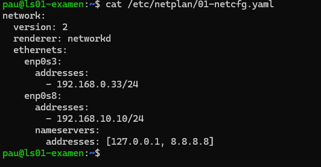

## Hora 3 – Instalación de Active Directory

Instalación de los paquetes necesarios para Samba AD DC, Kerberos y Winbind:

```bash
sudo apt update && sudo apt install -y \
  samba \
  smbclient \
  krb5-config \
  krb5-user \
  winbind \
  libpam-winbind \
  libnss-winbind
```

---

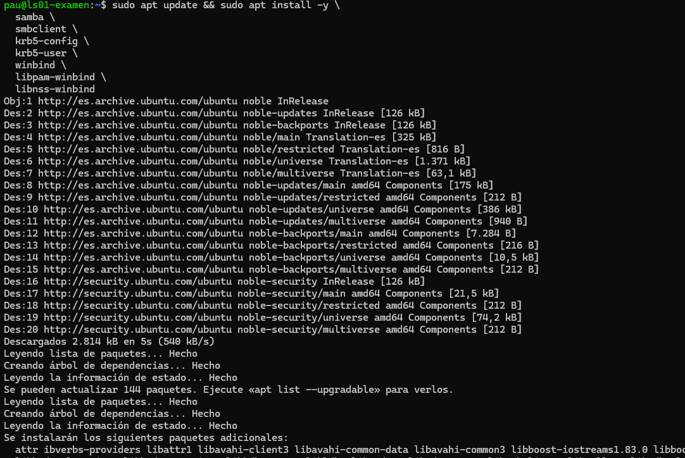

## Hora 4 – Configuración de Samba y DNS local

### Aprovisionamiento del dominio

```bash
sudo samba-tool domain provision \
  --use-rfc2307 \
  --realm=LAB01.LOCAL \
  --domain=LAB01 \
  --server-role=dc \
  --dns-backend=SAMBA_INTERNAL \
  --adminpass='Admin_21@'
```

### Configuración de Kerberos

```bash
sudo mv /etc/krb5.conf /etc/krb5.conf.bak
sudo cp /var/lib/samba/private/krb5.conf /etc/krb5.conf
```

### Habilitar y arrancar el servicio de Samba AD DC

```bash
sudo systemctl unmask samba-ad-dc
sudo systemctl enable samba-ad-dc
sudo systemctl start samba-ad-dc
sudo systemctl restart samba-ad-dc
```

### Configuración del resolver DNS local

Deshabilitar `systemd-resolved` y forzar el uso del DNS interno de Samba:

```bash
sudo systemctl stop systemd-resolved
sudo systemctl disable systemd-resolved
sudo rm /etc/resolv.conf

sudo tee /etc/resolv.conf <<'EOF'
nameserver 127.0.0.1
search lab01.local
EOF
```

---

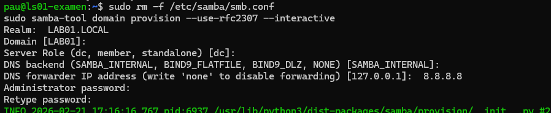
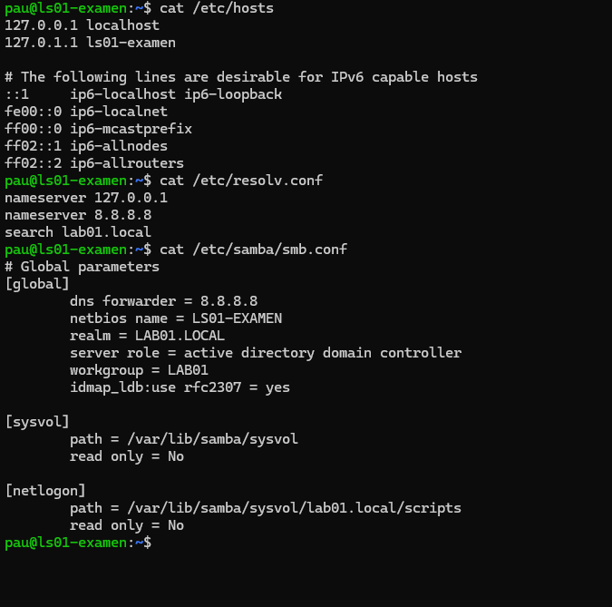
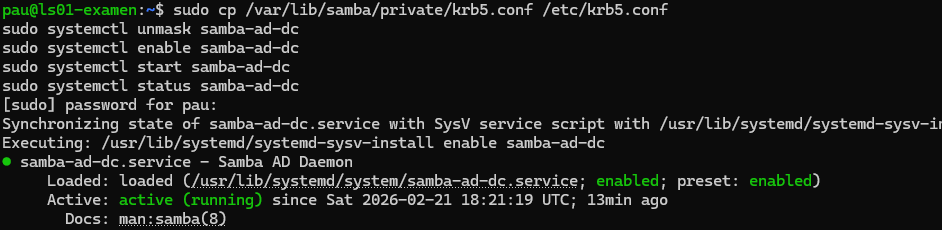
## Hora 5 – Verificación del controlador DNS

Comprobación de resolución DNS, servicios LDAP y autenticación Kerberos:

```bash
host -t A lab01.local
host -t SRV _ldap._tcp.lab01.local

kinit administrator@LAB01.LOCAL
klist
```

---

## Hora 6 – Obtención de información del dominio

Consulta de niveles funcionales y roles FSMO del dominio:

```bash
sudo samba-tool domain level show
sudo samba-tool fsmo show
```


---
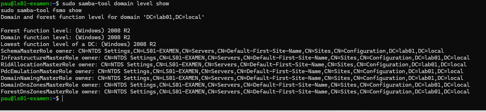
# Sprint 2 – Administración de Active Directory
**Link:** [https://chatgpt.com/share/68df6fab-8138-800a-9cf8-666b715bc3e1](https://chatgpt.com/share/68df6fab-8138-800a-9cf8-666b715bc3e1)
## Hora 1 – Preparación del entorno y unión al dominio

### Instructor Demo (15 min)

* Revisión de la topología de red.
* El servidor (Controlador de Dominio) ya se encuentra configurado.
* Gateway: `172.30.20.254` (modo bridge).
* Dominio: `corp.local`.

### Actividad del estudiante (45 min)

* Configurar el cliente con IP estática dentro de la misma subred.
* Configurar DNS apuntando a la IP del Controlador de Dominio.
* Probar conectividad y resolución de nombres.
* Unir el equipo cliente al dominio.


---

## Hora 2 – Usuarios y Grupos en Active Directory


### Creación de grupos

```bash
sudo samba-tool group add IT_Admins
sudo samba-tool group add Students
```

### Creación de usuarios

```bash
sudo samba-tool user create Alice Admin_21@
sudo samba-tool user create Bob Admin_21@
sudo samba-tool user create Charlie Admin_21@
```

### Asignación de usuarios a grupos

```bash
sudo samba-tool group addmembers IT_Admins Alice,Bob
sudo samba-tool group addmembers Students Charlie
```

### Verificación

```bash
sudo samba-tool user list
sudo samba-tool group listmembers IT_Admins
sudo samba-tool group listmembers Students
```

### Prueba de autenticación Kerberos

```bash
kdestroy
kinit Alice@LAB01.LOCAL
klist
```
---
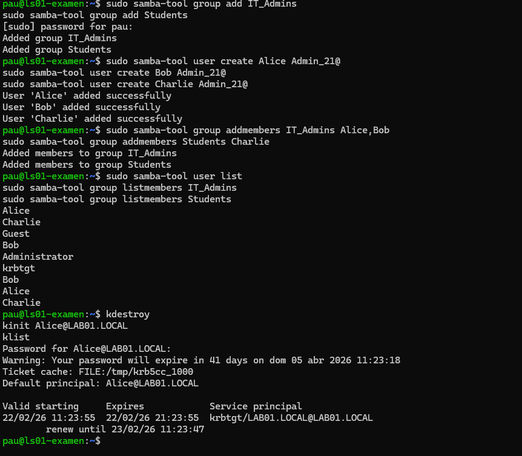
## Hora 3 – Unidades Organizativas (OUs)


### Creación de OUs

```bash
sudo samba-tool ou create "OU=IT_Department,DC=lab01,DC=local"
sudo samba-tool ou create "OU=HR_Department,DC=lab01,DC=local"
sudo samba-tool ou create "OU=Students,DC=lab01,DC=local"
```

### Movimiento de usuarios

```bash
sudo samba-tool user move Alice "OU=IT_Department,DC=lab01,DC=local"
sudo samba-tool user move Bob "OU=IT_Department,DC=lab01,DC=local"
sudo samba-tool user move Charlie "OU=Students,DC=lab01,DC=local"
```

### Movimiento de grupos

```bash
sudo samba-tool group move IT_Admins "OU=IT_Department,DC=lab01,DC=local"
sudo samba-tool group move Students "OU=Students,DC=lab01,DC=local"
```


---

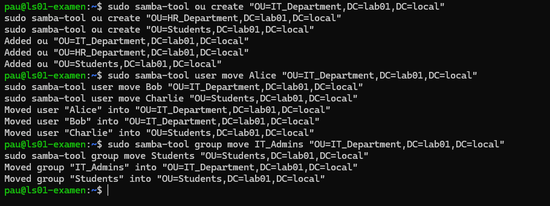
## Hora 4 – Introducción a Group Policy Objects (GPOs)

### Creación de GPO

```bash
kdestroy
kinit administrator
sudo samba-tool gpo create "Student_Policy" -U administrator
```

### Enlace del GPO a la OU Students

```bash
sudo samba-tool gpo setlink "OU=Students,DC=lab01,DC=local" "{E57A12D6-96E3-4D04-A6BE-4581F82AD443}" -U administrator
```

### Verificación del enlace

```bash
sudo samba-tool gpo getlink "OU=Students,DC=lab01,DC=local" -U administrator
sudo ldbsearch -H /var/lib/samba/private/sam.ldb -b "OU=Students,DC=lab01,DC=local" -s base gPLink
```


---
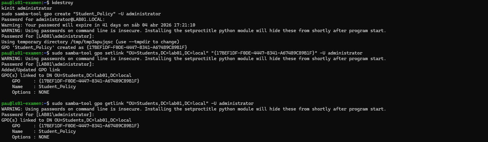
## Hora 5 – Políticas avanzadas y seguridad

### Configuración de políticas de contraseña y bloqueo

```bash
sudo samba-tool domain passwordsettings set --min-pwd-length=8
sudo samba-tool domain passwordsettings set --account-lockout-threshold=3
sudo samba-tool domain passwordsettings set --account-lockout-duration=5
```


---
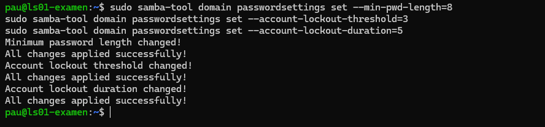
## Hora 6 – Cierre y reflexión

### Conceptos repasados

* Dominio vs Workgroup.
* Usuarios, grupos y OUs.
* Estructura y herencia de GPOs.
* Importancia de las políticas en entornos reales.

### Reflexión del estudiante

* ¿Cómo simplifica un dominio la administración?
* Ejemplo de mejora de seguridad usando GPOs.
* Principales dificultades encontradas durante el laboratorio.

---


# Sprint 3 – Recursos Compartidos y Permisos
* Sprint 3: [https://chatgpt.com/share/68eca619-0484-800a-8018-3ba202abe67b](https://chatgpt.com/share/68eca619-0484-800a-8018-3ba202abe67b)

##  Hora 1 – Introducción y preparación del entorno


### Creación de grupos

```bash
sudo samba-tool group add Finance
sudo samba-tool group add HR
sudo samba-tool group add "IT Support"
```

### Creación de usuarios

```bash
sudo samba-tool user create user01 Admin_21@
sudo samba-tool user create user02 Admin_21@
sudo samba-tool user create user03 Admin_21@
sudo samba-tool user create techsupport Admin_21@
```

### Asignación a grupos

```bash
sudo samba-tool group addmembers "IT Support" techsupport
```

---

##  Hora 2 – Creación y compartición de carpetas

### Creación de directorios

```bash
sudo mkdir -p /srv/samba/FinanceDocs
sudo mkdir -p /srv/samba/HRDocs
sudo mkdir -p /srv/samba/Public
```

### Configuración de comparticiones

```bash
sudo tee -a /etc/samba/smb.conf <<EOF

[FinanceDocs]
    path = /srv/samba/FinanceDocs
    read only = no
    guest ok = no

[HRDocs]
    path = /srv/samba/HRDocs
    read only = no
    guest ok = no

[Public]
    path = /srv/samba/Public
    read only = yes
    guest ok = yes
EOF
```

```bash
sudo systemctl restart samba-ad-dc
```

### Permisos iniciales

```bash
sudo chown root:Finance /srv/samba/FinanceDocs
sudo chown root:HR /srv/samba/HRDocs
sudo chown root:"Domain Users" /srv/samba/Public

sudo chmod 770 /srv/samba/FinanceDocs
sudo chmod 770 /srv/samba/HRDocs
sudo chmod 775 /srv/samba/Public
```

### Pruebas de acceso

```bash
sudo -u user01 ls /srv/samba/Public
sudo -u user01 ls /srv/samba/FinanceDocs
```

---
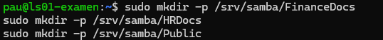
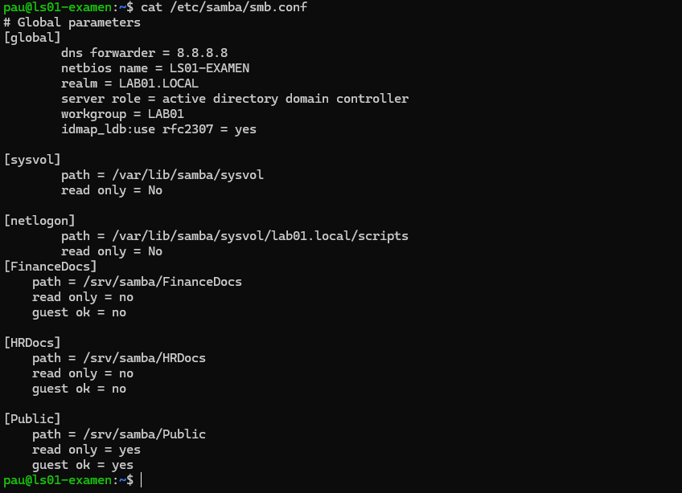
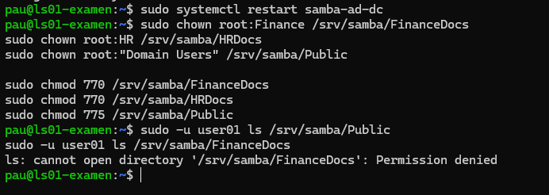
##  Hora 3 – Permisos avanzados y ACLs

### Instalación de ACL

```bash
sudo apt update
sudo apt install -y acl
```

### Aplicación de ACLs

```bash
sudo setfacl -m g:Finance:rwx /srv/samba/FinanceDocs
sudo setfacl -m g:HR:rwx /srv/samba/HRDocs
```

---
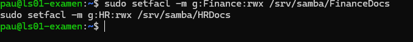

##  Hora 4 – Mapeo de unidades con GPO

### Creación de GPO

```bash
sudo samba-tool gpo create DriveMappingPolicy -U administrator
```

### Enlace del GPO al dominio

```bash
sudo samba-tool gpo setlink "DC=lab01,DC=local" "{A258FA31-82ED-4213-896E-69E0B585CB8F}" -U administrator
```

### Verificación

```bash
sudo samba-tool gpo getlink "DC=lab01,DC=local" -U administrator
sudo ldbsearch -H /var/lib/samba/private/sam.ldb -b "DC=lab01,DC=local" -s base gPLink
```

---
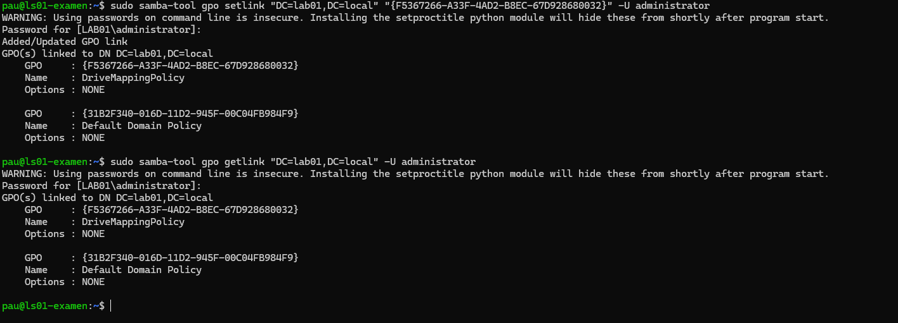
##  Hora 5 – Gestión de tareas y auditoría
```
#Servidor
sl

#Cliente
ssh pau@192.168.10.11
ps -aux | grep -w "sl"
kill -numero  {PID}

kill -19 4160
kill -18 4160
```

---

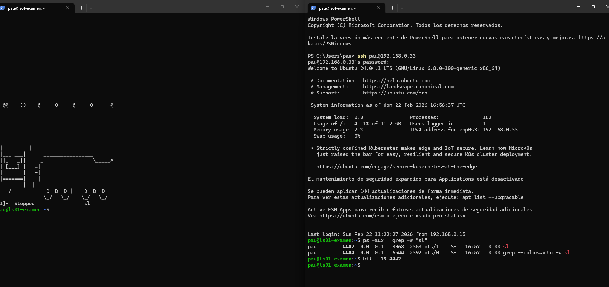


##  Hora 6 – Consolidación y reflexión

### Discusión

* Diferencias entre permisos Share, NTFS y ACL.
* Buenas prácticas de administración de recursos.


# Sprint 4 – Creating a Trust in GUI
**Link:** [https://chatgpt.com/share/68f5d608-8148-800a-9462-3d570237e576](https://chatgpt.com/share/68f5d608-8148-800a-9462-3d570237e576)


## Step 1 – DNS Resolution

* Ya esta configurado en Sprint 1 hora 4

## Step 2 – Active Directory Domains and Trusts
sudo samba-tool dns zonecreate localhost lab01trust.local -U Administrator

Editar el etc hosts para que quede asi


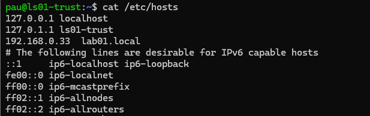

## Step 3 – New Trust Wizard


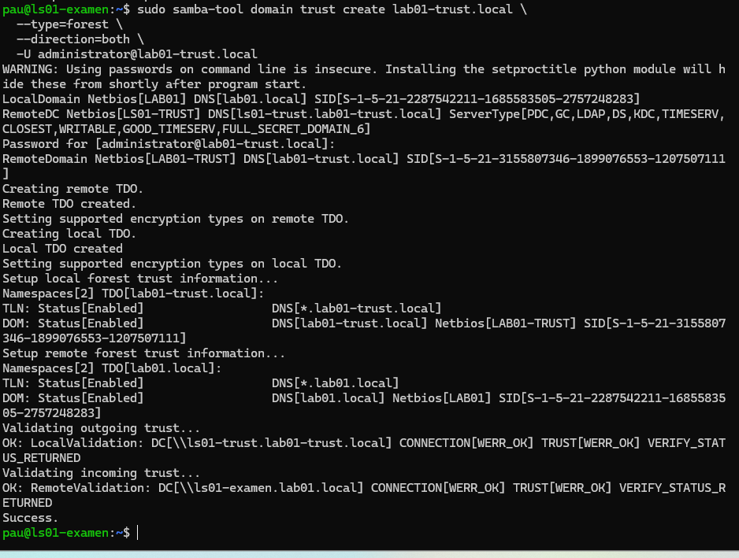


## Step 4 – Confirm Trust

Dominios que el trust se completo

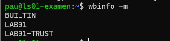


## Step 5 – Extra

crontab que la tarea se borreel directorio de descargas cada un dia

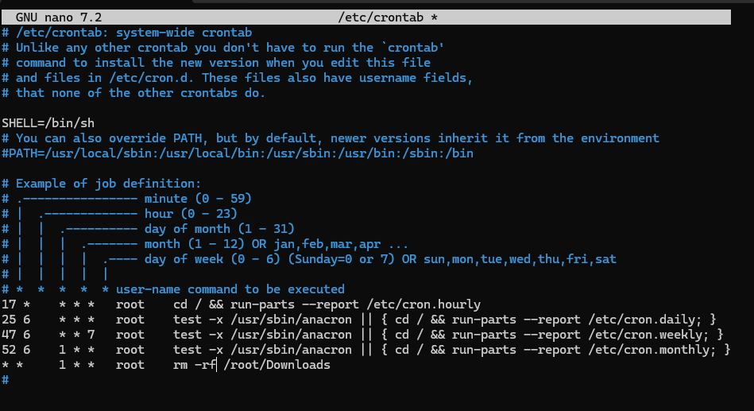


## Step 6 – Test Cross-Domain Access


